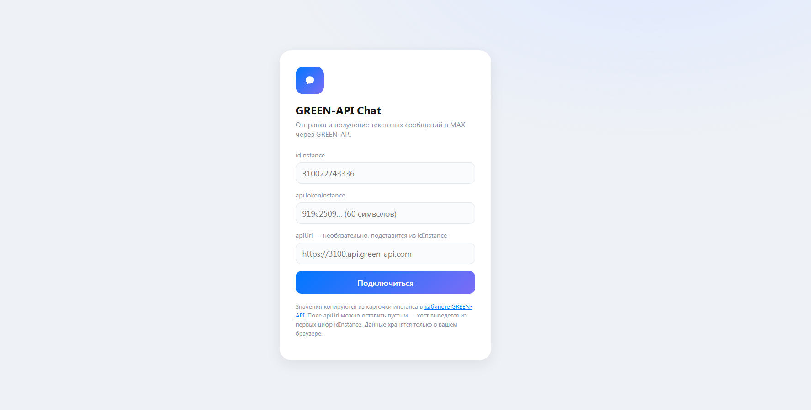
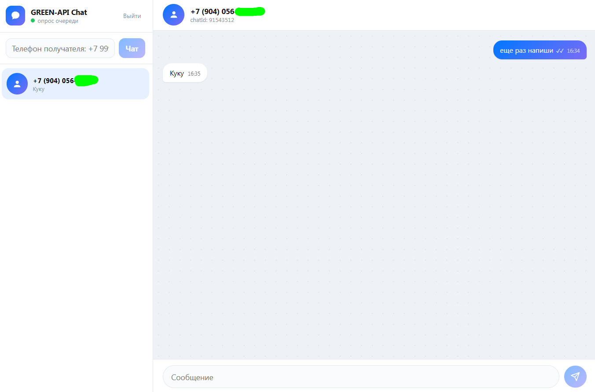

```markdown
# 🟢 GREEN-API MAX Chat

Веб-чат для отправки и получения текстовых сообщений в мессенджере MAX через GREEN-API. Тестовое задание на позицию Frontend-разработчик (React).

[](https://react.dev)
[](https://www.typescriptlang.org)
[](https://vitejs.dev)
[](LICENSE)

## 🚀 Живое демо

🔗 **[Открыть приложение](#)** *(деплой в процессе настройки)*

Введите свои `idInstance` и `apiTokenInstance` из [кабинета GREEN-API](https://console.green-api.com), создайте чат по номеру телефона и начните переписку.

## 📸 Скриншоты

| Форма подключения | Диалог с доставкой |
|---|---|
|  |  |

## ✅ Требования тестового задания (чек-лист)

| # | Требование | Реализация |
|---|---|---|
| 1 | Веб-приложение для отправки и получения сообщений в MAX | ✅ React + TypeScript SPA |
| 2 | Отправка текстовых сообщений (метод `SendMessage`) | ✅ `src/api/greenApi.ts:sendMessage` |
| 3 | Получение сообщений (HTTP API или вебхуки) | ✅ Поллинг `receiveNotification`, `src/hooks/useIncoming.ts` |
| 4 | Интерфейс в стиле web.max.ru | ✅ Сайдбар + окно чата, пузыри, аватары |
| 5 | Авторизация через `idInstance` + `apiTokenInstance` | ✅ `LoginForm`, хранение в `localStorage` |
| 6 | История сообщений сохраняется между сессиями | ✅ `src/lib/storage.ts` (localStorage) |
| 7 | Статусы доставки сообщений | ✅ ✓ → ✓✓ → ✓✓ (прочитано), через `outgoingMessageStatus` |
| 8 | Адаптивный дизайн (мобильная версия) | ✅ CSS Grid + media queries |

## 🛠 Стек

- **React 18** + **TypeScript** (строгая типизация, `noImplicitAny`)
- **Vite** (dev-сервер с CORS-прокси, HMR)
- **Чистый CSS** (без UI-библиотек — для портфолио)
- **localStorage** (история чатов и креды)
- **GREEN-API** (REST API мессенджера MAX)

## 🏗 Архитектура

### Почему поллинг, а не вебхуки?

Тестовое задание — про фронтенд. Вебхукам нужен бэкенд (сервер, который примет POST от GREEN-API и перешлёт в браузер через WebSocket). Поллинг очереди `receiveNotification` каждые 5 секунд — это pure frontend, работает даже на статическом хостинге.

### CORS и прокси

GREEN-API не отдаёт `Access-Control-Allow-Origin` для браузеров. Решение: **Vite dev proxy** локально, **serverless function** на Vercel в проде. Браузер ходит на свой origin, прокси пересылает запросы на `*.api.green-api.com`.

```ts
// vite.config.ts
server: {
  proxy: {
    '/api': {
      target: 'https://3100.api.green-api.com',
      changeOrigin: true,
      rewrite: (path) => path.replace(/^\/api/, ''),
    },
  },
}
```

### chatId ≠ номер телефона

В MAX `chatId` — это внутренний ID аккаунта (например, `91543512`), а не номер телефона. Отправка по номеру работает, но только для РФ/РБ и без возможности принимать входящие. Решение: перед созданием чата вызываем `CheckAccount`, получаем `chatId`, и только потом создаём диалог.

```ts
const account = await checkAccount(credentials, phone);
const chatId = String(account.chatId); // "91543512"
```

## 🕳 Грабли и выводы

### 1. Квота тарифа «Разработчик»

На бесплатном тарифе GREEN-API разрешено переписываться только с **3 чатами в месяц**. Превышение = ошибка `466 CORRESPONDENTS_QUOTA_EXCEEDED`. Решение: дисциплина квоты (тестовый собеседник + «Избранное» + неприкосновенный запас). При пересоздании инстанса квота сбрасывается, но учёт удалённых инстансов сохраняется на уровне аккаунта.

### 2. Пустое тело ответа `receiveNotification`

Когда очередь пуста, GREEN-API возвращает пустое тело (не `[]`, не `null`, а пустую строку). `res.json()` падает с `Unexpected end of JSON input`. Решение: читаем как `res.text()`, проверяем на пустоту, потом парсим.

### 3. Кластерные хосты

Каждому инстансу выдаётся свой `apiUrl` (например, `https://3100.api.green-api.com`), а не универсальный `api.green-api.com`. Прокси должен быть настроен под конкретный кластер. Решение: динамический `apiUrl` из `idInstance` (первые 4 цифры = номер кластера).

### 4. Структура уведомлений MAX vs WhatsApp

В MAX текстовые сообщения приходят как `messageData.extendedTextMessageData.text`, а не `textMessageData.textMessage`. Решение: перебор вариантов в парсере, защита от `undefined`.

## 🚀 Запуск локально

```bash
git clone https://github.com/dmironovru/green-api-max-chat.git
cd green-api-max-chat
npm install
npm run dev
# открыть http://localhost:5173
```

Введите `idInstance`, `apiTokenInstance`, `apiUrl` (оставьте пустым — выведется автоматически) из [кабинета GREEN-API](https://console.green-api.com).

## 🔒 Security

- `apiTokenInstance` хранится **только** в `localStorage` браузера пользователя и **никогда** не коммитится в репозиторий.
- На задеплоенной версии каждый посетитель вводит свои креды — чужие токены недоступны.
- Перед публикацией скриншотов/видео замазывайте `idInstance`, `apiTokenInstance`, номера телефонов, имена контактов.
- В проде проксирует serverless-функция (Vercel Edge Function) с whitelist `*.api.green-api.com` — токены не уходят на сторонние сервисы.

## 🌐 Деплой

> **TODO:** Настроить деплой на Vercel с serverless-прокси `/api/*` для обхода CORS. Каждый посетитель будет вводить свой `apiUrl` в форме, и прокси пересылать запросы на нужный кластер.

## 📝 License

MIT — используйте свободно.

---

**Автор:** Дмитрий Миронов  
**Email:** [mdsdzr@gmail.com](mailto:mdsdzr@gmail.com)  
**GitHub:** [dmironovru](https://github.com/dmironovru)  
**Сайт:** [dmitrymironov.ru](https://dmitrymironov.ru)
```